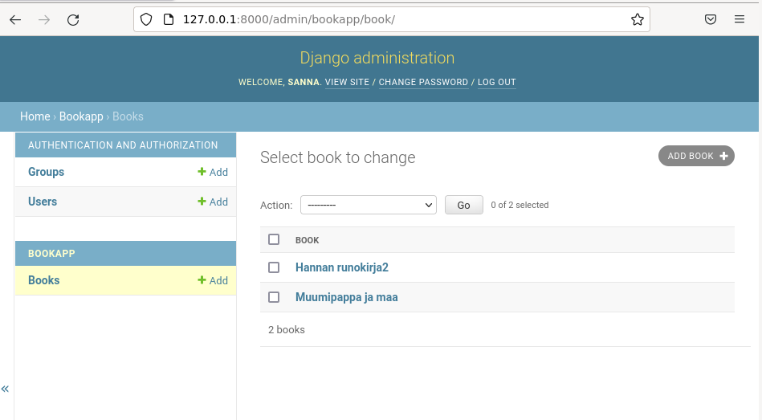
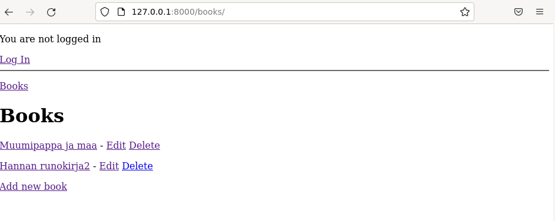
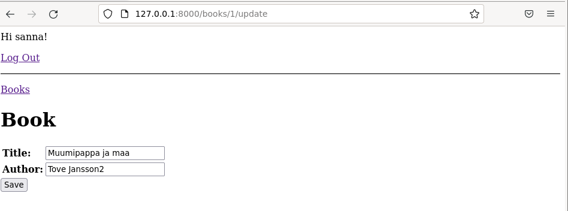
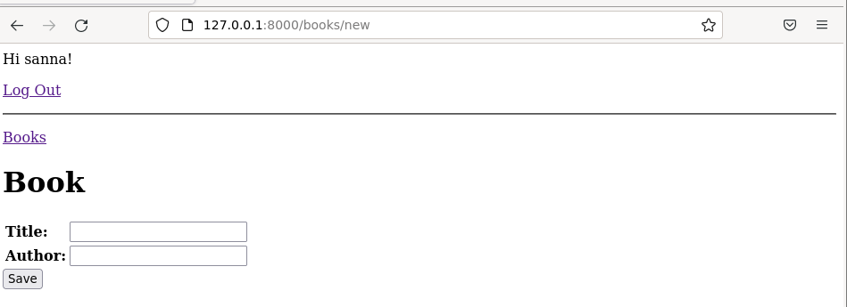
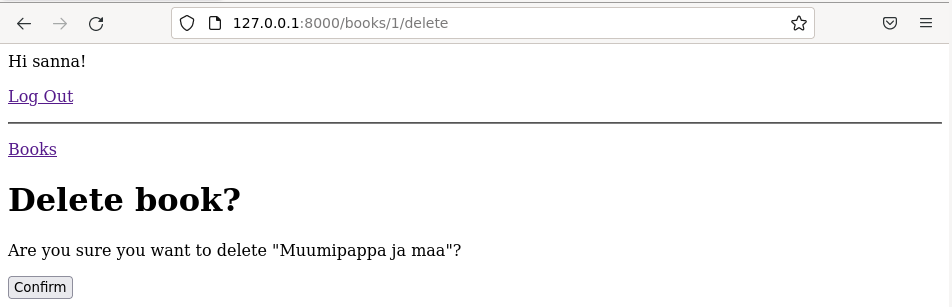

# Bookapp sovellus

Bookapp sovellus on Djangolla tehty webbisovellus, jolla voit katsella kirjalistaa, ja lisätä, muokata ja poistaa kirjoja listalta. Sovellus sisältää myös sisään- ja uloskirjautumisen käyttäjätunnuksella, jotka on luotu Djangon admin paneeli kautta. Tallennukset (lisäys, muokkaus, poisto) vaativat kirjautumisen. Sovellus ei kuitenkaan vielä suodata kirjalistaa mitenkään käyttäjätunnuksen perusteella.

## Asennus

Voit asentaa djangon koneellesi seuraavasti
```bash
cd 
mkdir bookcollection
cd bookcollection

virtualenv --system-site-packages -p python3 env
source env/bin/activate
which pip # tarkastetaan, että polku env:n sisällä

micro requirements.txt # sisällöksi django==3.2
pip install -r requirements.txt
django-admin --version # tarkistetaan asennus

kopioi bookproject sisältöineen github hakemistosta bookcollection hakemistoon

/manage.py createsuperuser # luo superuser
./manage.py runserver # käynnistä kehitysserveri

```

## Testaus

Serverin käynnistys kertoo ip-osoitteesi, pääset testaamaan sovellusta:

Admin-käyttöliittymä: http://127.0.0.1:8000/admin

Websovellus: http://127.0.0.1:8000/books/

## Kuvia

Admin-käyttöliittymä, jodts on muuta kirja lisätty.
<kbd></kbd>

Webbisovelluksen etusivulla näkyy lista kirjoista.
<kbd></kbd>

Klikkaamalla kirjan nimeä pääset kirjan tarkempiin tietoihin.
<kbd></kbd>

Kirjalistasta pääset myös muokkaamaan ja poistamaan kirjan, sekä lisäämään uuden kirjan. Ne vaativat sisäänkirjautumisen login-sivun kautta.
<kbd></kbd>

Muokkaus
<kbd></kbd>

Lisäys
<kbd></kbd>

Poisto
<kbd></kbd>