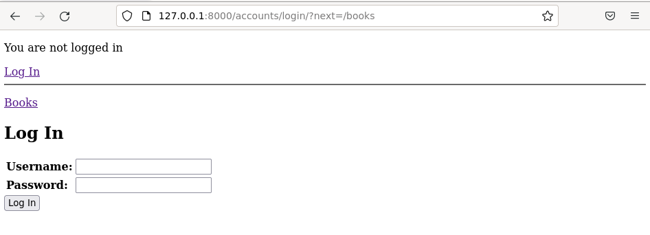

# Bookapp sovellus

Bookapp sovellus on Djangolla tehty webbisovellus, jolla voit katsella kirjalistaa, ja lisätä, muokata ja poistaa kirjoja listalta. Sovellus sisältää myös sisään- ja uloskirjautumisen käyttäjätunnuksella, jotka on luotu Djangon admin paneeli kautta. Tallennukset (lisäys, muokkaus, poisto) vaativat kirjautumisen. Sovellus ei kuitenkaan vielä suodata kirjalistaa mitenkään käyttäjätunnuksen perusteella.

Sovelluksen tekijä: Sanna Jyrinki

Sovelluksen lisenssi: [GNU GENERAL PUBLIC LICENSE2](../LICENSE)

Sovellus on tehty Tero Karvisen pitämän [Django-kurssin](https://terokarvinen.com/2021/python-web-service-from-idea-to-production-2022/) harjoituksena [PW4](https://terokarvinen.com/2021/python-web-service-from-idea-to-production-2022#pw4-mybooks).

CRUD-toiminnallisuus on tehty kurssipäivien opetusten mukaan. Login-toiminnallisuudessa on hyödynnetty Djangon materiaalia [Using the Django authentication system](https://docs.djangoproject.com/en/3.2/topics/auth/default/) yrityksen ja erehdyksen kautta sekä toisen opiskelijan django-projektia [ticketsystem](https://github.com/PutkisDude/simple-django).

## Asennus

Voit asentaa djangon koneellesi seuraavasti
```bash
cd 
mkdir bookcollection
cd bookcollection

virtualenv --system-site-packages -p python3 env
source env/bin/activate
which pip # tarkastetaan, että polku env:n sisällä

micro requirements.txt # sisällöksi django==3.2
pip install -r requirements.txt
django-admin --version # tarkistetaan asennus

kopioi bookproject sisältöineen github hakemistosta bookcollection hakemistoon

/manage.py createsuperuser # luo superuser
./manage.py runserver # käynnistä kehitysserveri

```

## Testaus

Serverin käynnistys kertoo ip-osoitteesi, pääset testaamaan sovellusta vaihtamalla tähän ip-osoitteesi:

Admin-käyttöliittymä: http://127.0.0.1:8000/admin

Websovellus: http://127.0.0.1:8000/books/

## Kuvia

Admin-käyttöliittymä, josta on muuta kirja lisätty.

<kbd></kbd>

Webbisovelluksen etusivulla näkyy lista kirjoista.
<kbd></kbd>

Klikkaamalla kirjan nimeä pääset kirjan tarkempiin tietoihin.

<kbd></kbd>

Kirjalistasta pääset myös muokkaamaan ja poistamaan kirjan, sekä lisäämään uuden kirjan. Ne vaativat sisäänkirjautumisen login-sivun kautta.

<kbd></kbd>

Muokkaus

<kbd></kbd>

Lisäys

<kbd></kbd>

Poisto

<kbd></kbd>